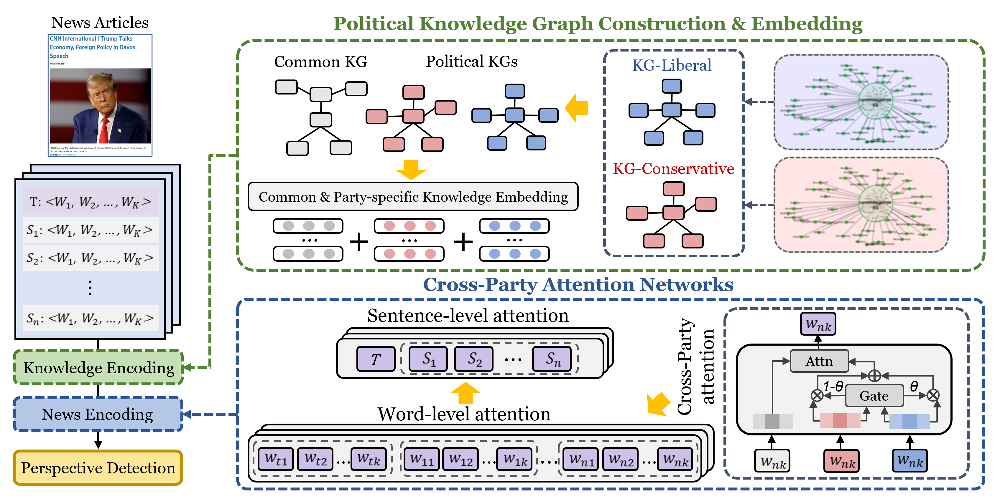

# [SAC'26] PANther: Party-specific Attention-based Networks for Accurate Political Perspective Detection

This repository provides an implementation of *PANther* as described in the paper: [PANther: Party-specific Attention-based Networks for Accurate Political Perspective Detection](https://doi.org/10.1145/3748522.3780001) by Seongeun Ryu and Sang-Wook Kim, In The 41st ACM/SIGAPP Symposium on Applied Computing (SAC '26), March 23–27, 2026, Thessaloniki, Greece.

## The Overview of PANther



## Available Dataset

1. [Reddit Dataset | Conservative and Liberal](https://drive.google.com/drive/folders/1RDSp2SoGgRFGybarVFUo6OPth8fiGjUC)
2. [YAGO Dataset | Papers With Code](https://paperswithcode.com/dataset/yago)

## Datasets

| Dataset | # of articles | Class distribution |
|:---:|:---:|:---:|
| SemEval | 645 | 407 / 238 |
| AllSides-S | 14.7k | 6.6k / 4.6k / 3.5k |
| AllSides-L | 719.2k | 112.4k / 202.9k / 99.6k / 62.6k / 241.5k |

## Political Knowledge Graphs

| | KCD | KG-liberal | KG-conservative |
|:---:|:---:|:---:|:---:|
| # of source posts | - | 203,654 | 224,281 |
| # of entities | 1,071 | 6,275 | 6,883 |
| # of relations | 10,703 | 32,492 | 36,254 |
| Political perspectives | Both | Liberal | Conservative |

## Code Availability

We are currently organizing and cleaning the codebase for public release. The source code, pre-trained embeddings, and datasets will be made available in this repository soon. 

## Citation

Please cite our paper if you have used the code in your work. You can use the following BibTex citation:

```
@inproceedings{ryu2026panther,
  title={PANther: Party-specific Attention-based Networks for Accurate Political Perspective Detection},
  author={Ryu, Seongeun and Kim, Sang-Wook},
  booktitle={Proceedings of the 41st ACM/SIGAPP Symposium on Applied Computing (SAC)},
  pages={1--8},
  year={2026},
  doi={10.1145/3748522.3780001}
}
```
